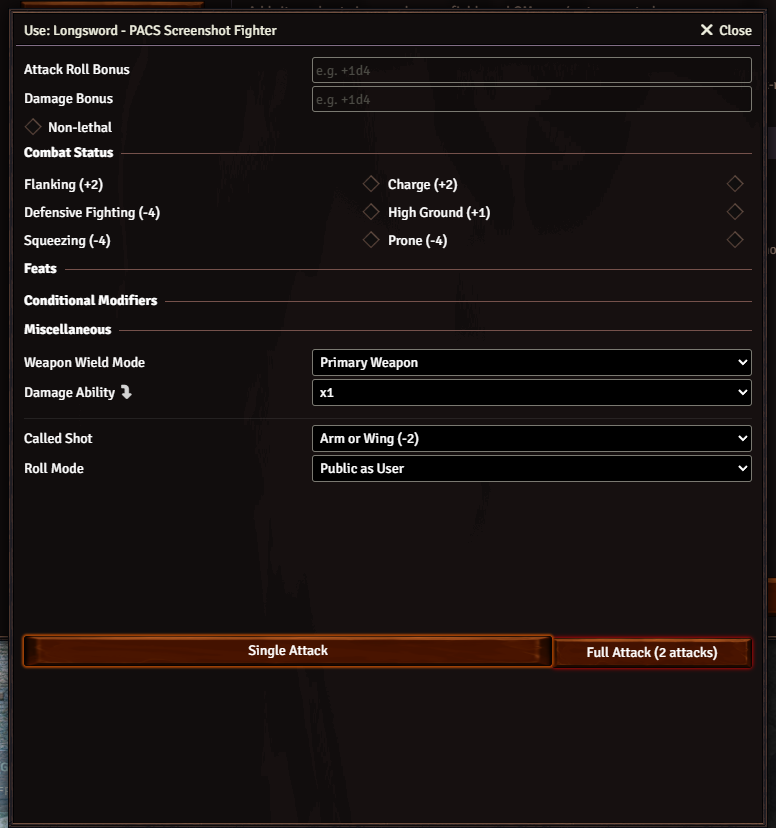
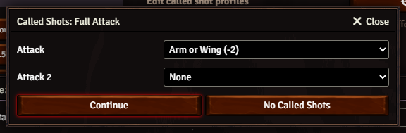
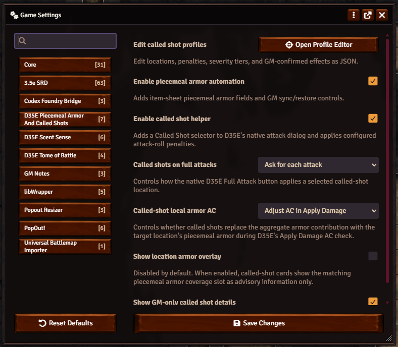

# D35E Piecemeal Armor And Called Shots

RAW-adapted piecemeal armor and called-shot automation for the [D35E Foundry VTT system](https://gitlab.com/dragonshorn/D35E).

This module is an adaptation aid for tables that want configurable piecemeal armor and called-shot workflows in D&D 3.5e games. It does not claim that either rules package is official D&D 3.5 RAW. The bundled defaults are RAW-adapted from Pathfinder 1e Ultimate Combat variant rules where D35E can support them.

**Support:** If this module helps your D35E table, donations are optional and support continued maintenance, compatibility testing, release packaging, and documentation.

[](https://github.com/sponsors/SpencerZPoole) [](https://paypal.me/mrpooley92)

## Install

In Foundry, open **Add-on Modules > Install Module**, paste this into **Manifest URL**, and install:

```text
https://github.com/SpencerZPoole/d35e-piecemeal-armor-called-shots/releases/latest/download/module.json
```

After installation, open a D35E world, go to **Game Settings > Manage Modules**, enable **D35E Piecemeal Armor And Called Shots**, and reload if Foundry asks.

Versioned release assets are published on GitHub. For v1.4.1, the release manifest is:

```text
https://github.com/SpencerZPoole/d35e-piecemeal-armor-called-shots/releases/download/v1.4.1/module.json
```

## Features

- Adds `PAcS: Torso`, `PAcS: Arms`, and `PAcS: Legs` slots directly to D35E's native Armor and Equipment inventory list.
- Uses the normal D35E `Armor` slot as the baseline suit or torso piece, then overrides only the categories a table mixes.
- Provides a D35E-calibrated starter catalog for common piecemeal armor mappings such as padded, leather, studded leather, hide, scale mail, chain shirt, chainmail, breastplate, banded mail, splint mail, half-plate, and full plate.
- Ships a `PAcS Armor Pieces` compendium with ready-to-use items such as `[PAcS] Studded Leather, Legs`, `[PAcS] Chainmail, Torso`, and `[PAcS] Full Plate, Arms`.
- Keeps PAcS slots category-specific. Dropping a vanilla full armor suit such as leather, chainmail, or splint mail onto a PAcS slot asks whether to break that suit into matching `[PAcS]` pieces instead of silently treating the whole suit as one piece.
- Keeps simple baseline-only armor native to D35E while using a hidden zero-weight, zero-price, slotless D35E armor carrier only for composite piecemeal math.
- Adds a `Called Shot` dropdown inside D35E's native attack/use dialog.
- Injects called-shot penalties into D35E attack math, so expanded rolls show entries such as `Called Shot: Ear -10` or `Called Shot Range/Reach: not adjacent -2`.
- Can adjust D35E's native Apply Damage AC check for called shots that target weaker or stronger piecemeal armor locations.
- Lets armor components and called-shot profile locations name multiple coverage slots, such as `head; eyes; ears`.
- Offers an optional, disabled-by-default helmet house rule that uses configured equipment in D35E's native `Head` slot for Head/Eye/Ear local armor and optional Spot/Listen penalties.
- Enforces RAW-adapted Improved/Greater Called Shot full-attack limits by default, with GM-facing warn-only and no-requirement modes for house rules.
- Ships `PAcS Armor Pieces`, `PAcS Called-Shot Feats`, and `PAcS Helmets` item compendia with convenience records for optional-rule setup.
- Automates called-shot severity and outcomes after D35E Apply Damage, with a default GM confirmation step for critical or debilitating effects and a restore ledger for misclick recovery.
- Prevents double-counting by marking profile source items as worn in the profile while the hidden zero-weight, zero-price carrier contributes composite D35E armor math.
- Includes an in-Foundry profile editor for locations, penalties, coverage slot(s), and outcome effects.

## Screenshots







## Quick Start

1. Open a D35E world, go to `Game Settings > Manage Modules`, enable the module, and reload if Foundry asks.
2. Equip ordinary armor normally. With no piecemeal overrides, D35E keeps handling armor AC exactly as before.
3. Open the actor sheet inventory. The normal D35E `Armor` slot is the baseline armor.
4. For actual piecemeal overrides, open Foundry's Compendium Packs sidebar and use `PAcS Armor Pieces`. Import or drag items such as `[PAcS] Studded Leather, Legs` and `[PAcS] Chainmail, Torso`.
5. Drag `[PAcS] ... Torso`, `[PAcS] ... Arms`, and `[PAcS] ... Legs` items onto the matching `PAcS:` inventory slots. Empty PAcS slots inherit from the baseline armor when that armor maps to the category.
   - If a vanilla full armor suit is dropped onto a PAcS slot, the module offers to break that suit into its matching `[PAcS]` pieces. Torso-only armor, custom equipment, shields, and other non-PAcS items are rejected instead. Canceling leaves the actor unchanged.
6. Click a normal D35E weapon or attack use control and choose a target from the native dialog's `Called Shot` dropdown.
7. Roll normally. The called-shot penalty appears in the D35E attack breakdown.
8. Use D35E's native Apply Damage button. When piecemeal armor and called shots are both enabled, AC Details shows the location armor adjustment.
9. The module determines severity. By default, normal effects apply automatically, while critical and debilitating effects ask the GM before changing the target.
10. For table-specific behavior, open Foundry's right sidebar gear icon, choose `Game Settings`, then select `D35E Piecemeal Armor And Called Shots`.

See [docs/USER_GUIDE.md](docs/USER_GUIDE.md) for the full end-user guide.

## Compatibility

- Foundry VTT: verified on v14.363.
- D35E: verified on D35E 3.0.2.
- Foundry v13: not marked verified until a real v13 smoke test is completed.

The module is additive. It does not edit D35E system files, mutate actors on world load, or run in worlds where the module has not been enabled.

## Configuration

Module settings live in Foundry's right sidebar gear tab under `Game Settings > D35E Piecemeal Armor And Called Shots`. The main toggles are `Enable piecemeal armor` and `Enable called shots`, so either half of the module can be used independently. Turning `Enable piecemeal armor` off is the intended called-shots-only mode: it hides `PAcS: Torso`, `PAcS: Arms`, and `PAcS: Legs` from actor sheets and suspends armor automation while preserving existing profile flags for later. `Called-shot full-attack feat rules` defaults to `Require feats (RAW-adapted)`, while `Warn only` and `Do not require feats` let a table loosen the full-attack permission check without granting feat bonuses. `Called-shot effect automation` defaults to `GM confirms severe effects`: normal outcomes apply after D35E Apply Damage, but critical and debilitating outcomes ask the GM before changing actor data. Optional helmet head coverage and helmet Spot/Listen penalties are separate house-rule toggles, disabled by default. The called-shot profile editor is available in the same settings category. Profiles are world settings, so a GM can clone or replace the bundled defaults with table-specific locations, penalties, coverage, and effects.

When piecemeal armor and called shots are both enabled, the native Apply Damage check automatically uses location armor for called-shot coverage. A covered location uses the matching piece value; an exposed location uses local armor `0` instead of silently keeping the full armor profile. Coverage slot fields accept one value or a delimiter-separated list, so a broader armor piece can cover `torso, arms, legs`. If the helmet house rule is enabled, a configured item equipped in D35E's native `Head` slot can cover `head; eyes; ears` with its own local head armor value, without adding to the actor's total AC. The bundled `[PAcS]` helmet starter values use the matching D35E full armor bonus for called-shot local armor only and include editable house-rule weight, price, and HP fields. GMs can lower the local armor values for grittier family-cap tables. Simply equipping an item named "helmet" is not enough; the item must come from `PAcS Helmets` or be marked `Use as helmet head coverage`.

Melee called shots follow the RAW-adapted range rule: a non-adjacent target adds `Called Shot Range/Reach: not adjacent -2`, even if the attacker has D35E reach and can legally attack that square. The D35E `Reach` field expects a number of feet such as `10` or `15`, not a size word. Ranged called shots double range-increment penalties, with at least `-2` beyond 30 feet.

The bundled armor catalog uses the PF1e piecemeal structure but is calibrated for D35E/D&D 3.5e armor bonuses. For a complete catalog suit, `torso + arms + legs + full-suit +1` equals the normal D&D 3.5e armor bonus, so a chainmail suit resolves to `5` and full plate resolves to `8`.

Masterwork, special material, and magic armor follow the supplied Ultimate Combat structure where D35E can represent the result. Separately created or enchanted pieces use only the most protective active piece for masterwork and enhancement benefits: torso first, then legs, then arms. Pieces marked as part of an enchanted suit apply their masterwork/enhancement only when the whole active torso+arms+legs suit shares the same suit ID; partial suit pieces behave as normal nonmagical pieces. Breaking down a normal magic or masterwork full suit keeps those benefits suit-bound instead of creating separately enchanted pieces, unless the GM edits the generated pieces afterward. Mithral-style material adjustments apply only when every active selected piece shares the same material.

The module includes `PAcS Armor Pieces`, `PAcS Called-Shot Feats`, and `PAcS Helmets` compendia under the Foundry Compendium Packs sidebar. Use `PAcS Armor Pieces` as the recommended source for torso, arm, and leg override items, with findable names such as `[PAcS] Studded Leather, Legs`. Import `Improved Called Shot` and `Greater Called Shot` when a character should receive the automated feat benefits. Import `[PAcS]` helmets when your table enables the helmet house rule and wants preconfigured Head-slot items for the D35E armor types. These items are optional-rule support records for D35E, not D&D 3.5 RAW.

Supported effect specs:

- `note`: creates an ActiveEffect note with module flags.
- `condition`: toggles a D35E actor condition such as `fatigued`, `stunned`, or `blind`.
- `abilityDamage`: rolls and applies ability damage to a D35E ability damage field.
- `abilityDrain`, `bleed`, `speedPenalty`, `dropHeld`, and `flag`: create reversible ledger-backed notes or flags when D35E has no exact native field.
- `death`: marks the target dead and drives HP low enough to make the result obvious.
- `saveBranch`: rolls Fortitude, Reflex, or Will against the AC hit by the attack and applies success/failure branches.
- `activeEffect`: creates a custom Foundry ActiveEffect using supplied changes.

## Caveats

- Called-shot automation can apply lethal and permanent outcomes. The default setting asks the GM before critical or debilitating effects are applied, and GMs can restore applied effects from the target actor's `Called Shot Effects` header button.
- The bundled defaults are optional-rule adaptation, not D&D 3.5 RAW.
- The piecemeal catalog is D35E-calibrated, not exact Pathfinder RAW.
- Fast-forward attacks keep D35E's no-dialog behavior and do not show the called-shot selector.
- Some Ultimate Combat results have no exact D35E native field. Those are recorded as explicit actor flags or ActiveEffect notes instead of pretending D35E has native support.
- Imported `[PAcS]` armor piece items do not change AC just by sitting in inventory. Assign them to the matching `PAcS: Torso`, `PAcS: Arms`, or `PAcS: Legs` slot.
- PAcS slots no longer accept ordinary armor as direct piece sources. Use the breakdown prompt for vanilla full suits, or import the matching item from `PAcS Armor Pieces`.
- If a table uses only called shots, turn off `Enable piecemeal armor` to hide the PAcS slots. If the slots are still visible immediately after changing the setting, close and reopen the actor sheet.

## Public API

After Foundry is ready, the module exposes `game.d35ePiecemealCalledShots`:

- `calculatePiecemealArmor(actorOrItems, options)`
- `resolveArmorProfile(actor)`
- `applyArmorProfile(actor, options)`
- `clearArmorProfile(actor)`
- `setArmorProfileBaseline(actor, itemId)` for migration or advanced scripts; the primary UI uses the native D35E `Armor` slot as baseline.
- `setArmorProfileSlot(actor, category, itemId)` for assigning a real PAcS armor-piece item to a matching profile category.
- `previewArmorSync(actor)` for legacy aggregate migration or recovery tooling.
- `syncArmorAggregate(actor, options)` for legacy aggregate migration or recovery tooling.
- `restoreArmorComponents(actor)` for legacy aggregate migration or recovery tooling.
- `getCalledShotProfiles()`
- `getCalledShotOptions()`
- `stageCalledShot(actor, item, locationId, options)`
- `applyCalledShotOutcome(options)`
- `getCalledShotLedger(actor)`
- `restoreCalledShotLedgerEntry(actor, entryId)`
- `restoreAllCalledShotLedgerEntries(actor)`
- `getIntegrationStatus()`

## Development

```powershell
npm run validate
npm run build:release
```

Before publishing or handing off changes, run the local security gate:

```powershell
node <path-to-local-security-scan.mjs> --root <module-root> --changed-only
```

## Support

Use [GitHub issues](https://github.com/SpencerZPoole/d35e-piecemeal-armor-called-shots/issues) for bugs, compatibility reports, and feature requests. That is the preferred support path. Please include Foundry version, D35E version, module version, browser console errors, and a short reproduction path.
