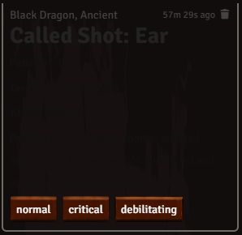
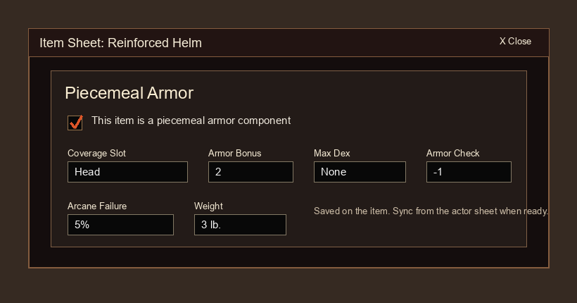
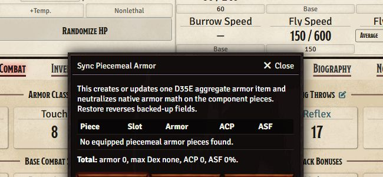

# User Guide

D35E Piecemeal Armor And Called Shots adds optional-rule helpers to the D35E Foundry VTT system. It is meant to support GM adjudication, not replace it.

The module has two main workflows:

- Piecemeal armor: configure equipment pieces, preview the combined armor profile, then sync one D35E-native aggregate armor item.
- Called shots: pick a called-shot location from D35E's normal attack dialog, roll normally, and let the GM apply any outcome from chat.

## First Five Minutes

1. Enable the module in a D35E world.
2. Open an actor sheet.
3. Click `Piecemeal Armor` in the actor sheet header to preview, sync, or restore armor pieces.
4. Open a weapon or attack from the normal D35E sheet controls.
5. Choose a location from the native attack dialog's `Called Shot` dropdown, or leave it on `None`.
6. Roll the attack and expand the result to see the called-shot modifier in D35E's native breakdown.
7. Open module settings and use `Edit called shot profiles` when your table wants different locations, penalties, or effects.

## Where The Controls Live

| Control | Location | Purpose |
| --- | --- | --- |
| `Piecemeal Armor` | Actor sheet header | Preview, sync, or restore aggregate armor math. |
| Shield icon | Actor inventory rows | Opens an equipment item so it can be configured as a piecemeal armor component. |
| `Piecemeal Armor` fieldset | Equipment item sheet | Stores armor-piece values and coverage slot. |
| `Called Shot` dropdown | D35E attack/use dialog | Applies a configured called-shot penalty through the native attack workflow. |
| Full-attack picker | Opens after `Full Attack` when configured | Lets the user choose `None` or a location for each D35E attack label. |
| Outcome buttons | Called-shot chat card | Lets the GM confirm normal, critical, or debilitating effects. |
| Profile editor | Module settings | Edits locations, penalties, coverage slots, and outcome effects. |

## Called Shots

Click the normal D35E use or attack control for a weapon or attack item. The native D35E attack dialog gains a `Called Shot` dropdown near the rest of the roll options.

Leave the selector on `None` for a normal attack. Choose a location when the attack is meant to be a called shot. The penalty is injected into D35E's normal attack calculation, so the expanded attack roll can show entries such as `Called Shot: Ear -10` alongside native modifiers.

Fast-forward attacks keep D35E's no-dialog behavior. They do not show the called-shot dropdown.

## Full Attacks

The `Called shots on full attacks` setting controls what happens when a location is selected and the native D35E `Full Attack` button is used.

Modes:

- `Ask for each attack`: opens one secondary picker before dice roll. The first row starts with the location chosen in the native dialog; every row can be changed to `None` or another enabled location.
- `First attack only`: applies the selected location to the first D35E attack only.
- `Every attack`: applies the selected location to each generated attack.
- `Disable on full attacks`: ignores called-shot selections when `Full Attack` is used.

If the per-attack picker is closed without confirming, the full attack continues with no called shots.

## Called-Shot Chat Cards

After a called-shot roll, the module posts a chat card for the GM. The card shows the selected location, attack penalty, and configurable outcome buttons.

The GM decides whether to apply a normal, critical, or debilitating outcome. This is intentional: the original D&D 3.5e system does not provide one universal called-shot subsystem, and the bundled defaults are table-editable optional-rule scaffolding.

## Piecemeal Armor

Open an equipment item and use the `Piecemeal Armor` fieldset. The item can remain in inventory as a component record.

When the actor is ready, click `Piecemeal Armor` on the actor sheet to preview the aggregate.

Syncing changes actor item data:

- The module creates or updates one item named `Piecemeal Armor Aggregate`.
- The aggregate item carries the D35E armor values that should contribute to actor math.
- Component items keep module flags but have their native D35E armor fields backed up and neutralized.
- Restore reverses the backed-up fields and removes the aggregate item.

Inventory chips:

- `piecemeal?`: this equipment can be configured as a piece.
- `piece: <slot>`: this item is currently a piecemeal armor component.
- `aggregate`: this is the generated D35E armor item used for actual armor math.
- `synced component`: this item has native D35E armor fields backed up by the module.

## Profile Editor

Open **Configure Settings > Module Settings > D35E Piecemeal Armor And Called Shots > Edit called shot profiles**.

Profiles control:

- location labels and IDs;
- attack penalties;
- whether locations are enabled;
- matching armor coverage slots;
- normal, critical, and debilitating outcome effects.

Effect snippets use JSON because they map directly to the module's declarative effect engine. Use the Advanced JSON section for full-profile import/export backups.

## Troubleshooting

### I do not see the called-shot dropdown

Confirm the module is enabled, called-shot support is enabled in module settings, and the attack was opened through a normal D35E dialog. Shift-click or other fast-forward attacks skip the dialog by design.

### The attack penalty did not apply

Confirm the attack was rolled from the same native dialog where the location was selected. Expand the D35E attack result and look for a modifier such as `Called Shot: Ear -10`.

### The full-attack picker did not open

Check the `Called shots on full attacks` setting. The picker opens only in `Ask for each attack` mode and only when a called-shot location was selected in the native dialog.

### Armor totals look doubled

Use the actor `Piecemeal Armor` dialog and choose Restore, then Sync again. The aggregate item should be the only D35E-native armor item contributing armor math; components should be component records.

### I want D&D 3.5 RAW only

Leave called shots disabled and use piecemeal armor only if your table has adopted a house rule for it. The module is explicit that the bundled defaults are not official D&D 3.5 RAW.
