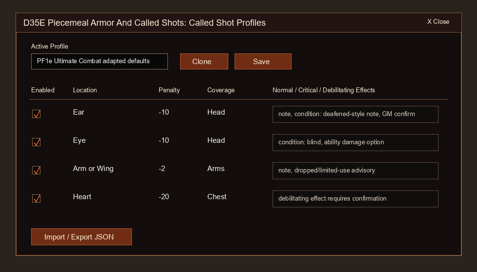

# User Guide

D35E Piecemeal Armor And Called Shots adds optional-rule helpers to the D35E Foundry VTT system. It defaults to RAW-adapted Ultimate Combat automation where D35E can support it, while staying explicit that these are not official D&D 3.5 RAW.

The module has two main workflows:

- Piecemeal armor: use D35E's normal inventory. The native `Armor` slot is the baseline, and the module adds `PAcS: Torso`, `PAcS: Arms`, and `PAcS: Legs` slots for mixed pieces.
- Called shots: pick a called-shot location from D35E's normal attack dialog, roll normally, and let D35E Apply Damage resolve hit, local armor AC, severity, and automatic outcomes.

## First Five Minutes

1. Open a D35E world, go to `Game Settings > Manage Modules`, enable the module, and reload if Foundry asks.
2. Open an actor sheet.
3. Equip ordinary armor normally. With no profile overrides, D35E handles armor AC normally.
4. If the actor mixes pieces, drag armor items onto `PAcS: Torso`, `PAcS: Arms`, or `PAcS: Legs` in the actor sheet's Armor and Equipment list.
5. Open a weapon or attack from the normal D35E sheet controls.
6. Choose a location from the native attack dialog's `Called Shot` dropdown, or leave it on `None`.
7. Roll the attack and expand the result to see the called-shot modifier in D35E's native breakdown.
8. Open the module settings when your table wants legacy behavior, different locations, penalties, effects, or full-attack behavior.

## Where The Controls Live

| Control | Location | Purpose |
| --- | --- | --- |
| Native `Armor` slot | Actor sheet Armor and Equipment list | Uses a normal D35E armor item as the baseline armor source. |
| `PAcS: Torso`, `PAcS: Arms`, `PAcS: Legs` | Actor sheet Armor and Equipment list | Replaces only that armor category. Empty PAcS slots inherit the native Armor baseline when the baseline catalog supports that category. |
| `Worn in profile` chip | Actor inventory rows | Marks source items whose native D35E armor math is temporarily neutralized to prevent double-counting. |
| `Called Shot` dropdown | D35E attack/use dialog | Applies a configured called-shot penalty through the native attack workflow. |
| Full-attack picker | Opens after `Full Attack` when configured | Lets the user choose `None` or a location for each D35E attack label. |
| Called Shot Effects | Actor sheet header after an automatic outcome | Lets a GM restore automatic called-shot effects if the wrong damage card or target was used. |
| Profile editor | Module settings | Edits locations, penalties, coverage slots, and outcome effects. |

## Module Settings

Open Foundry's right sidebar, click the gear icon, choose `Game Settings`, then select `D35E Piecemeal Armor And Called Shots` from the category list on the left.

Settings:

- `Rules mode`: `RAW-adapted automation` is the default and applies Ultimate Combat style formulas, feat limits, severity, saves, and outcomes where D35E can support them. `Legacy v1.0 workflow` keeps the older permissive full-attack behavior and manual outcome buttons.
- `Edit called shot profiles`: opens the profile editor for locations, attack penalties, severity tiers, coverage slots, and automatic or legacy manual effects.
- `Piecemeal armor workflow`: `Native armor profile` is the v1.2 default. `Legacy aggregate sync` keeps the old manual sync/restore workflow for older worlds that still need it.
- `Enable piecemeal armor automation`: adds the PAcS inventory slots, item piece fields, local armor data, and legacy compatibility tools.
- `Enable called shot helper`: adds the `Called Shot` selector to D35E's native attack dialog and applies the configured attack penalty to the native roll breakdown.
- `Called shots on full attacks`: controls whether full attacks ask per attack, apply to the first attack only, apply to every attack, or ignore called-shot selections. See [Full Attacks](#full-attacks).
- `Called-shot local armor AC`: controls whether D35E's native Apply Damage AC check uses the called location's piecemeal armor instead of the active armor profile's total armor contribution, shows that adjustment only, or ignores local armor. See [Local Armor AC](#local-armor-ac).
- `Show location armor overlay`: adds the matching piecemeal armor coverage slot to called-shot chat cards as advisory information only.
- `Show GM-only called shot details`: shows source/profile metadata and outcome context to GM users. This is a client setting, so each GM can choose whether they want the extra detail.

## Called Shots

Click the normal D35E use or attack control for a weapon or attack item. The native D35E attack dialog gains a `Called Shot` dropdown near the rest of the roll options.

Leave the selector on `None` for a normal attack. Choose a location when the attack is meant to be a called shot. The penalty is injected into D35E's normal attack calculation, so the expanded attack roll can show entries such as `Called Shot: Ear -10` alongside native modifiers.

Fast-forward attacks keep D35E's no-dialog behavior. They do not show the called-shot dropdown.

## Local Armor AC

If `Called-shot local armor AC` is set to `Adjust AC in Apply Damage`, a called shot carries its location into D35E's native Apply Damage workflow. When the GM clicks Apply, the module adjusts the target's AC by replacing the active armor profile's total armor contribution with the matching piecemeal armor location.

Example: if the armor profile contributes 18 armor AC but the target's legs contribute 17, a called shot to the legs applies `Called Shot Local Armor: Leg -1` in AC Details before D35E checks hit and crit. If the called location is better protected than the profile total, the adjustment can be positive.

Modes:

- `Adjust AC in Apply Damage`: changes the D35E hit and crit check and adds an AC Details row.
- `Show adjustment only`: adds the AC Details row as advisory context but does not change the hit or crit check.
- `Disabled`: leaves Apply Damage AC unchanged.

Local armor AC needs an active armor profile or legacy synced armor data, a called-shot profile location with matching coverage slot(s), and at least one resolved piece for that coverage. Called-shot touch attacks are checked against normal AC rather than touch AC. No-check damage, missing targets, and targets without matching piecemeal armor keep D35E's normal behavior.

## Full Attacks

The `Called shots on full attacks` setting controls what happens when a location is selected and the native D35E `Full Attack` button is used. In RAW-adapted mode, those choices are still gated by the attacker feats.

Modes:

- `Ask for each attack`: opens one secondary picker before dice roll. The first row starts with the location chosen in the native dialog; every row can be changed to `None` or another enabled location.
- `First attack only`: applies the selected location to the first D35E attack only.
- `Every attack`: applies the selected location to each generated attack.
- `Disable on full attacks`: ignores called-shot selections when `Full Attack` is used.

If the per-attack picker is closed without confirming, the full attack continues with no called shots.

RAW-adapted feat behavior:

- No feat: a called shot is treated as a single full-round attack; the module blocks selected called shots from D35E Full Attack.
- `Improved Called Shot`: adds `+2` to called-shot attacks and allows one called shot during a multiattack or full attack.
- `Greater Called Shot`: allows multiple called shots in the same round, applies `-5` to each additional called shot after the first, and lowers the debilitating minimum damage from `50` to `40`.

## Called-Shot Chat Cards

After a called-shot roll, the module posts a chat card for the GM. In RAW-adapted mode, the card is an audit cue: use D35E's native Apply Damage button, and the module resolves hit state, post-DR damage, severity, saves, and automatic effects after D35E finishes its damage workflow.

Severity rules:

- Miss or damage fully negated by DR: no called-shot effect.
- Hit under the debilitating threshold: normal outcome.
- Confirmed critical under the debilitating threshold: critical outcome.
- Damage at least half target maximum HP and at least the minimum threshold: debilitating outcome.

Saving throw DCs use the attack total, matching the AC hit by the called shot. If D35E has no native field for an outcome, the module records a flagged actor note instead of silently faking native support.

Legacy mode keeps the older manual chat buttons. In that mode, the GM decides whether to apply normal, critical, or debilitating outcomes from the card.

## Restoring Called-Shot Effects

Automatic effects are recorded on a target actor ledger with the source message, attacker, location, severity, save results, actor updates, and created ActiveEffects. If an outcome was applied to the wrong target or the table changes the adjudication, open the target sheet and click `Called Shot Effects` in the actor header. Restore reverses recorded actor updates and removes ActiveEffect notes created by that ledger entry.

## Piecemeal Armor

The v1.2 workflow starts from the D35E armor users already understand. Equip normal armor normally. If the actor is only wearing one ordinary D35E armor item and no profile overrides are set, D35E remains the source of truth for AC.

When the actor mixes armor pieces, open the actor sheet inventory area and stay in D35E's normal Armor and Equipment list.

Inventory slots:

- `Armor`: the ordinary D35E armor slot. This is the baseline armor source.
- `PAcS: Torso`: replaces only torso armor.
- `PAcS: Arms`: replaces only arm armor.
- `PAcS: Legs`: replaces only leg armor.
- Clear icon on a PAcS slot item: restores that item and empties the PAcS slot.
- Native trash/delete on a PAcS slot item: deletes that inventory item and clears only the PAcS slot that referenced it. Use the clear icon when you want to keep the item.
- Dragging a PAcS-worn item back to the native `Armor` slot makes it the baseline suit again. Occupied PAcS slots stay as overrides.

Empty PAcS slots inherit from the native Armor baseline when the baseline maps to that category. For example, studded leather in the Armor slot can fill torso, arms, and legs. A breastplate maps to torso only, so empty arms and legs remain unarmored unless a table assigns overrides.

RAW-adapted math:

- One resolved piece uses that piece's listed armor statistics.
- Two resolved pieces add armor bonus, cost, and weight, then use the worst max Dex, ACP, ASF, and speed limits.
- Three resolved categories make a suit and gain the extra `+1` armor bonus.
- Mixed full suits add the RAW `+5%` arcane spell failure adjustment.

Known armor items use the module catalog for padded, leather, studded leather, hide, chain, breastplate/plate torso, half-plate, and full plate mappings. Unknown custom armor is marked `Needs piece values` instead of being guessed. Use the shield icon on an inventory row to open explicit piece fields for unusual published pieces or custom 3.5e adaptations before assigning them.

When a composite profile is active, the module creates a hidden zero-weight, slotless D35E carrier so D35E still owns the final AC, max Dex, ACP, ASF, and speed math without occupying the visible Armor slot. Source items remain visible in inventory with a `worn in profile` chip, and their native armor math is backed up and neutralized to prevent double-counting. If Dex to AC looks lower than expected, also check D35E encumbrance because it can apply its own max Dex cap after armor. The old visible `Piecemeal Armor Aggregate` item is only used in `Legacy aggregate sync` mode.

When you hover an AC value on the D35E sheet, the source breakdown expands the hidden carrier into the active PAcS torso, arms, legs, full-suit bonus, and enhancement rows. Zero-value pieces still appear there so odd-looking combinations, such as chainmail legs contributing `+0`, remain explainable.

## Profile Editor

Open the right sidebar gear tab, choose `Game Settings`, select `D35E Piecemeal Armor And Called Shots`, then click `Open Profile Editor` next to `Edit called shot profiles`.

Profiles control:

- location labels and IDs;
- attack penalties;
- whether locations are enabled;
- matching armor coverage slot(s);
- normal, critical, and debilitating outcome effects.

Effect snippets use JSON because they map directly to the module's declarative effect engine. Use the Advanced JSON section for full-profile import/export backups.

Supported effect types include `note`, `condition`, `abilityDamage`, `abilityDrain`, `bleed`, `speedPenalty`, `dropHeld`, `flag`, `death`, `saveBranch`, and custom `activeEffect`. Severe outcomes are intentionally reversible through the ledger.

## Troubleshooting

### I do not see the called-shot dropdown

Confirm the module is enabled, called-shot support is enabled in module settings, and the attack was opened through a normal D35E dialog. Shift-click or other fast-forward attacks skip the dialog by design.

### The attack penalty did not apply

Confirm the attack was rolled from the same native dialog where the location was selected. Expand the D35E attack result and look for a modifier such as `Called Shot: Ear -10`.

### The full-attack picker did not open

Check the `Called shots on full attacks` setting. The picker opens only in `Ask for each attack` mode and only when a called-shot location was selected in the native dialog. In RAW-adapted mode, the attacker also needs `Improved Called Shot` for one called shot during a full attack or `Greater Called Shot` for multiple called shots.

### A called shot killed or maimed the target

That is expected in RAW-adapted mode for some critical and debilitating outcomes. Open the target actor sheet and use `Called Shot Effects` to restore the ledger entry if the wrong target, wrong damage card, or wrong table ruling was used.

### Armor totals or weight look doubled

Clear each occupied `PAcS:` slot with its clear icon, then assign the pieces again. In the native profile workflow, only the hidden slotless profile carrier should contribute composite D35E armor math; source items should show `worn in profile` and should not also contribute native armor AC.

### The profile says Needs piece values

The selected armor item is not in the starter catalog and is not configured as an explicit piecemeal armor item. Configure the item with piece category and armor values, then assign it again.

### Should pieces be armor or miscellaneous equipment?

Armor items are easiest because they can be dragged from D35E compendiums or inventory into the profile slots. Miscellaneous records still work for custom table pieces when they have explicit module piece values.

### Where should I report issues?

GitHub issues are the preferred place for bug reports, compatibility notes, and follow-up testing notes.

### I still see a Piecemeal Armor Aggregate item

Open module settings and confirm `Piecemeal armor workflow` is set to `Native armor profile`. Clear occupied `PAcS:` slots if the actor is already using the native workflow. The visible aggregate is retained only for the legacy workflow.

### Local armor did not change the Apply Damage AC

Confirm `Called-shot local armor AC` is set to `Adjust AC in Apply Damage`, the target has an active armor profile or legacy synced armor data, and the called-shot location's coverage slot matches at least one resolved armor piece. Touch AC and no-check damage intentionally skip local armor AC.

### I want D&D 3.5 RAW only

Leave called shots disabled and use piecemeal armor only if your table has adopted a house rule for it. The module is explicit that the bundled defaults are Ultimate Combat adaptation, not official D&D 3.5 RAW.
