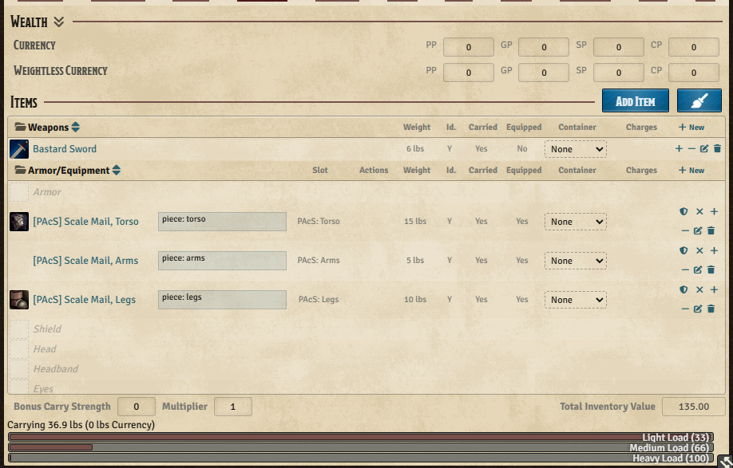
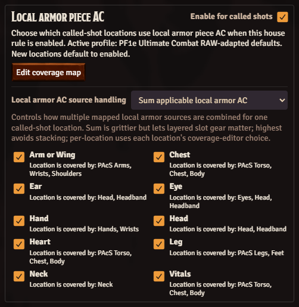
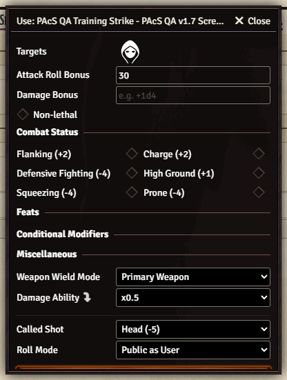
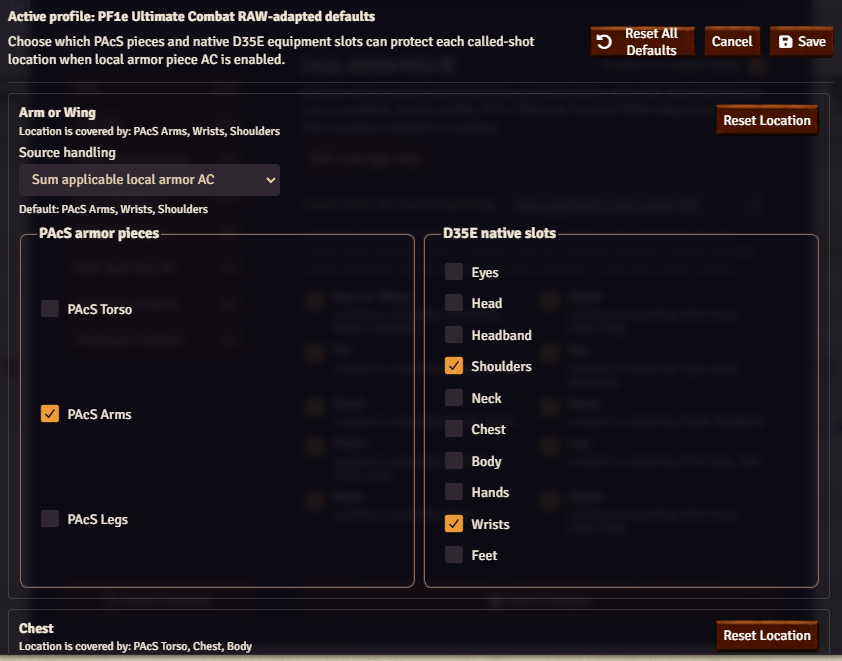
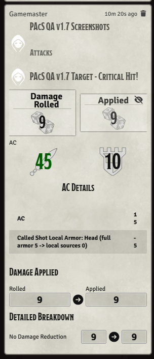

# User Guide

D35E Piecemeal Armor And Called Shots adds optional-rule helpers to the D35E Foundry VTT system. It defaults to RAW-adapted Ultimate Combat automation where D35E can support it, while staying explicit that these are not official D&D 3.5 RAW.

The module has two main workflows:

- Piecemeal armor: use D35E's normal inventory. The native `Armor` slot is the baseline, and the module adds `PAcS: Torso`, `PAcS: Arms`, and `PAcS: Legs` slots for mixed pieces.
- Called shots: pick a called-shot location from D35E's normal attack dialog, roll normally, and let D35E Apply Damage resolve hit, severity, and outcomes.

## First Five Minutes

1. Open a D35E world, go to `Game Settings > Manage Modules`, enable the module, and reload if Foundry asks.
2. Open an actor sheet.
3. Equip ordinary armor normally. With no profile overrides, D35E handles armor AC normally.
4. If the actor mixes pieces, open the `PAcS Armor Pieces` compendium and use items such as `[PAcS] Studded Leather, Legs` or `[PAcS] Chainmail, Torso`.
5. Drag those `[PAcS]` piece items onto the matching `PAcS: Torso`, `PAcS: Arms`, or `PAcS: Legs` slot in the actor sheet's Armor and Equipment list.
6. Open a weapon or attack from the normal D35E sheet controls.
7. Choose a location from the native attack dialog's `Called Shot` dropdown, or leave it on `None`.
8. Roll the attack and expand the result to see the called-shot modifier in D35E's native breakdown.
9. Open the module settings when your table wants different locations, penalties, effects, automation, or full-attack behavior.

## Where The Controls Live

| Control | Location | Purpose |
| --- | --- | --- |
| Native `Armor` slot | Actor sheet Armor and Equipment list | Uses a normal D35E armor item as the baseline armor source. |
| `PAcS: Torso`, `PAcS: Arms`, `PAcS: Legs` | Actor sheet Armor and Equipment list | Replaces only that armor category. Empty PAcS slots inherit the native Armor baseline when the baseline catalog supports that category. |
| `Worn in profile` chip | Actor inventory rows | Marks source items whose native D35E armor math is temporarily neutralized to prevent double-counting. |
| `Called Shot` dropdown | D35E attack/use dialog | Applies a configured called-shot penalty through the native attack workflow. |
| Full-attack picker | Opens after `Full Attack` when configured | Lets the user choose `None` or a location for each D35E attack label. |
| `PAcS Armor Pieces` pack | Compendium Packs sidebar | Recommended source for ready-to-use torso, arm, and leg override items such as `[PAcS] Studded Leather, Legs`. |
| `PAcS Called-Shot Feats` pack | Compendium Packs sidebar | Convenience item records for `Improved Called Shot` and `Greater Called Shot`. |
| `PAcS Helmets` pack | Compendium Packs sidebar | Optional Head-slot helmet records for exposed headshot coverage and Spot/Listen penalty support. |
| Called Shot Effects | Actor sheet header after an applied outcome | Lets a GM restore called-shot effects if the wrong damage card or target was used. |
| Profile editor | Module settings | Edits locations, penalties, coverage slots, and outcome effects. |
| Local armor locations | Module settings | Chooses which called-shot locations may use the advanced local armor piece AC house rule. |
| Local armor coverage map | Module settings, inside the local armor panel | Edits which PAcS pieces and native D35E slots can cover each called-shot location, plus per-location sum/highest handling when that mode is selected. |

## Armor Piece Pack

The easiest way to build a piecemeal outfit is to use the bundled `PAcS Armor Pieces` compendium.

1. Open Foundry's Compendium Packs sidebar.
2. Open `PAcS Armor Pieces`.
3. Search for the armor type and category, such as `[PAcS] Studded Leather, Legs`, `[PAcS] Chainmail, Torso`, or `[PAcS] Full Plate, Arms`.
4. Drag the item to the actor, then assign it to the matching `PAcS:` slot. You can also drag directly onto the slot when Foundry allows it.

The normal D35E armor item still belongs in the native `Armor` slot when it is the baseline suit. The `[PAcS]` piece items are for overrides: torso, arms, and legs. Importing a `[PAcS]` item into inventory by itself does not change AC. The item changes armor math only after it is assigned to the matching `PAcS: Torso`, `PAcS: Arms`, or `PAcS: Legs` slot.

The pack uses the module's D35E-calibrated PF1e piecemeal adaptation. For example, `[PAcS] Chainmail, Torso` is a chainmail-labeled item that carries the calibrated chain torso values, while `[PAcS] Half-Plate, Legs` is a half-plate-labeled item whose flags use the chain leg piece needed by the half-plate suit mapping. The display name matches what users search for; the hidden flags preserve the correct category and family math.

If a `[PAcS]` item says `Legs`, drop it on `PAcS: Legs`. The module rejects explicit pack pieces dropped onto the wrong PAcS category instead of silently turning them into a different piece.

Ordinary D35E armor items belong in the native `Armor` slot as the baseline suit. If you drop a vanilla full suit such as leather, chainmail, splint mail, or full plate onto a PAcS slot, the module asks whether to break that suit down. Confirming consumes one copy of the original suit, creates all matching `[PAcS]` pieces, assigns only the piece for the slot you dropped on, and leaves the other pieces carried in inventory. Copied masterwork or enhancement data remains tied to the original suit, so one generated piece by itself is not separately magical or masterwork unless the GM edits it. Canceling makes no actor changes. Torso-only armor such as chain shirts and breastplates, shields, custom equipment, and other non-PAcS items do not open the breakdown prompt.

## Module Settings

Open Foundry's right sidebar, click the gear icon, choose `Game Settings`, then select `D35E Piecemeal Armor And Called Shots` from the category list on the left.

Settings:

- `Edit called shot profiles`: opens the profile editor for locations, attack penalties, severity tiers, coverage slots, and outcome effects.
- `Enable piecemeal armor`: adds the PAcS inventory slots, item piece fields, piecemeal armor math, and hidden D35E carrier. Turning it off hides the PAcS slots and suspends piecemeal armor automation without disabling called shots. This is the intended called-shots-only mode. Local armor piece AC is visually locked while piecemeal armor is off, but its saved choices are preserved.
- `Enable called shots`: adds the `Called Shot` selector to D35E's native attack dialog, applies the configured attack penalty to the native roll breakdown, carries context into Apply Damage, and posts outcome cards. Turning it off does not disable piecemeal armor. Called-shot-only settings are visually locked while called shots are off, but their saved choices are preserved.
- `Called shots use local armor piece AC`: advanced, optional, and disabled by default. Selected called-shot locations replace only the defender's armor/profile armor contribution with the matching local armor piece contribution. This usually makes called shots easier for the attacker. It requires both piecemeal armor and called shots to be enabled.
- `Local armor AC source handling`: chooses whether multiple mapped local armor sources are summed, whether only the highest applicable bonus is used, or whether each location uses its own sum/highest choice from the coverage map editor.
- Local armor location toggles: appear inline under `Called shots use local armor piece AC` in a tinted child section. They control which active profile locations may use local armor piece AC when the advanced master setting is on. New or missing locations default to enabled under the disabled master switch.
- `Edit coverage map`: opens the advanced local armor coverage editor. Use it when your table disagrees with the default map of which PAcS pieces and native D35E slots protect each called-shot location.
- `Enable exposed headshots`: optional and disabled by default. Head, Eye, and Ear called shots remove the defender's active armor bonus only when the target has no equipped item in the mapped native headgear slots; mapped Eyes, Head, or Headband equipment keeps the defender's full armor bonus.
- `Enable exposed hand shots`: optional and disabled by default. Hand called shots remove the defender's active armor bonus only when the target has no equipped item in the mapped native handgear slots; mapped Hands or Wrists equipment keeps the defender's full armor bonus.
- `Apply helmet Spot/Listen penalties`: optional and disabled by default. This setting remains independent of piecemeal armor and called-shot automation because it only checks equipped D35E `Head`-slot gear. Configured PAcS helmets can use per-item Spot and Listen values, while ordinary equipped D35E `Head`-slot items can use the default penalty fields below this setting.
- `Called-shot effect automation`: controls actor changes after Apply Damage. `GM confirms severe effects` is the default: normal outcomes apply automatically, while critical and debilitating outcomes ask the GM first. `Apply effects automatically` applies all resolved outcomes. `Advisory only` never changes actor data unless the GM clicks a chat-card severity button.
- `Called shots on full attacks`: controls whether full attacks ask per attack, apply to the first attack only, apply to every attack, or ignore called-shot selections. See [Full Attacks](#full-attacks).
- `Called-shot full-attack feat rules`: controls only whether the module blocks full-attack called shots when the attacker lacks the optional feats. `Require feats (RAW-adapted)` is the default. `Warn only` allows the full attack but warns about missing Improved or Greater Called Shot. `Do not require feats` allows the full attack without warnings. Feat bonuses still require the actor to actually have the feat.
- Called-shot AC uses normal applicable AC by default. See [Called-Shot AC, Local Armor, And Exposed Slots](#called-shot-ac-local-armor-and-exposed-slots).
- `Show called-shot coverage overlay`: adds the matching piecemeal armor coverage slot to called-shot chat cards as advisory information only. It does not change called-shot AC.
- GM-only source/profile metadata appears automatically to GM users; players still see the useful called-shot result information.

## Called Shots

Click the normal D35E use or attack control for a weapon or attack item. The native D35E attack dialog gains a `Called Shot` dropdown near the rest of the roll options.

Leave the selector on `None` for a normal attack. Choose a location when the attack is meant to be a called shot. The penalty is injected into D35E's normal attack calculation, so the expanded attack roll can show entries such as `Called Shot: Ear -10` alongside native modifiers.

Fast-forward attacks keep D35E's no-dialog behavior. They do not show the called-shot dropdown.

Default location penalties:

| Location | Attack penalty |
| --- | ---: |
| Arm, Chest, Leg | -2 |
| Hand, Head, Vitals | -5 |
| Ear, Eye, Heart, Neck | -10 |

Those defaults come from the PF1e Ultimate Combat called-shot table and can be edited in the profile editor.

## Called-Shot AC, Local Armor, And Exposed Slots

A called shot carries its location into D35E's native Apply Damage workflow. By default, the attack is checked against the defender's normal applicable AC. PAcS no longer replaces the armor bonus with only the armor covering that body part.

The module still applies the Ultimate Combat called-shot defense rules that D35E can represent:

- Touch and ranged touch called shots are checked against normal AC instead of touch AC.
- Non-soft cover bonuses are doubled for called shots.
- Concealment miss chances are increased as the called-shot rule describes.
- If damage reduction fully negates the damage, the called shot has no special effect.

The optional local armor piece AC rule is an advanced non-RAW house rule:

- `Called shots use local armor piece AC`: selected locations replace the defender's armor/profile armor contribution with mapped local protection.
- Local armor location toggles: live directly beneath the master setting and let the GM turn local armor replacement on or off per called-shot location. The location defaults are all enabled, but they do nothing while the master setting is off.
- `Local armor AC source handling`: defaults to summing every applicable mapped source. GMs can switch every location to the highest applicable bonus if they do not want native slot gear and PAcS pieces to stack, or select `Use per-location overrides`.
- `Edit coverage map`: opens a focused editor where each called-shot location can check or uncheck PAcS pieces and native D35E equipment slots. The editor also lets each location choose summed or highest-source handling when the global setting is `Use per-location overrides`. `Reset Location` and `Reset All Defaults` reset both coverage and per-location handling so a table can experiment without losing the module's recommended defaults.

Only the armor contribution changes. Shield, natural armor, Dexterity, deflection, dodge, size, and other AC sources remain intact. PAcS resolves local armor from active PAcS profiles, recognized native Armor-slot baseline suits, and explicit armor-like values on mapped D35E native slot items. Ordinary mapped slot gear with no armor value contributes `0` to local armor AC, but it can still block the softer exposed-slot fallback.

The default protection map is:

| Called-shot location | Local armor sources |
| --- | --- |
| Arm or Wing | PAcS Arms, Wrists, Shoulders |
| Hand | Hands, Wrists |
| Eye | Eyes, Head, Headband |
| Ear, Head | Head, Headband |
| Neck | Neck |
| Chest, Heart, Vitals | PAcS Torso, Chest, Body |
| Leg | PAcS Legs, Feet |

These are defaults, not locked rules. `Edit coverage map` stores only table overrides, so reset buttons return a location or the whole editor to the module defaults. If a GM removes every coverage source from a location, that location resolves as local armor `0` when local armor piece AC is enabled for it. The same effective map controls exposed head/hand fallback for mapped native slots, so changing Eye from `Eyes, Head, Headband` to only `Head` also changes which native items can prevent Eye exposure.

Example: a target's active profile contributes `7` armor AC, but the called location matches only `1` point of mapped arm protection. With local armor piece AC enabled for that location, the Apply Damage AC Details row shows `Called Shot Local Armor: Arm (profile 7 -> local sources 1) -6`. With the setting disabled, the attack checks the target's normal applicable AC.

The optional exposed rules are separate non-RAW house rules:

- `Enable exposed headshots`: Head, Eye, and Ear called shots remove the target's active armor/profile armor contribution only if the target has no equipped item in the mapped native headgear slots.
- `Enable exposed hand shots`: Hand called shots remove the target's active armor/profile armor contribution only if the target has no equipped item in the mapped native handgear slots.

These settings remove only the armor contribution, including armor enhancement as part of armor AC. They do not remove shield, natural armor, Dexterity, deflection, dodge, size, or other AC sources. Any equipped item in a mapped native slot prevents the exposed adjustment; it can be native D35E gear, a PAcS item, magic gear, or custom gear. If local armor piece AC applies to the same hit check, exposed head/hand does not stack on top of it.

In short, local armor piece AC is the grittier option: covered locations use only mapped local protection. Exposed head/hand is the softer compromise: the target loses armor only when the mapped native slots are empty, and any equipped mapped-slot equipment keeps the full armor bonus.

Example: a target with chainmail contributing `5` armor AC and no equipped Head or Headband item is attacked with a Head called shot. With exposed headshots disabled, the attack checks the target's normal AC. With exposed headshots enabled, the Apply Damage AC Details row shows `Called Shot Exposed Head: no Head/Headband item (armor 5 -> 0) -5`.

## Helmet Skill Penalties

Helmet AC is not a fourth piecemeal armor category. The `PAcS Helmets` pack provides normal Head-slot equipment records that can prevent exposed headshots and optionally carry table-defined Spot and Listen penalties.

Workflow:

1. Open Foundry's Compendium Packs sidebar and drag a `[PAcS]` helmet from `PAcS Helmets` to the actor, or use any other D35E item that can occupy the native `Head` slot.
2. Equip the item in D35E's native `Head` slot.
3. If your table uses exposed headshots, that equipped Head-slot item is enough to prevent exposed Head and Ear armor loss. Eye called shots can also be covered by mapped Eyes or Headband items.
4. If your table also wants helmet skill penalties, enable `Apply helmet Spot/Listen penalties`. Ordinary equipped Head-slot items use the default Spot and Listen penalties from module settings. For a `[PAcS]` helmet, open the helmet item sheet, check `Use PAcS helmet skill penalties`, and enter per-item Spot and Listen values if that helmet should override the defaults.

Spot and Listen penalties are table-defined. The module defaults ordinary headgear to `-2` Spot and `-2` Listen, and a GM can change either default to `0` or any other integer. Explicit `[PAcS]` helmet values take priority; an explicit per-item `0` means no penalty for that skill. The penalties appear as a `Helmet (...)` row in native D35E Spot and Listen roll breakdowns and do not permanently change actor skill values.

## Full Attacks

The `Called shots on full attacks` setting controls what happens when a location is selected and the native D35E `Full Attack` button is used. By default, those choices are still gated by the attacker feats. A GM can loosen only the permission check with `Called-shot full-attack feat rules`.

Modes:

- `Ask for each attack`: opens one secondary picker before dice roll. The first row starts with the location chosen in the native dialog; every row can be changed to `None` or another enabled location.
- `First attack only`: applies the selected location to the first D35E attack only.
- `Every attack`: applies the selected location to each generated attack.
- `Disable on full attacks`: ignores called-shot selections when `Full Attack` is used.

If the per-attack picker is closed without confirming, the full attack continues with no called shots.

Feat behavior:

- No feat: a called shot is treated as a single full-round attack; the module blocks selected called shots from D35E Full Attack.
- `Improved Called Shot`: adds `+2` to called-shot attacks and allows one called shot during a multiattack or full attack.
- `Greater Called Shot`: allows multiple called shots in the same round, applies `-5` to each additional called shot after the first, and lowers the debilitating minimum damage from `50` to `40`.

The full-attack feat setting has three modes:

- `Require feats (RAW-adapted)`: preserves the RAW-adapted default above.
- `Warn only`: allows the selected full-attack mode but warns when the attacker lacks Improved or Greater Called Shot.
- `Do not require feats`: allows the selected full-attack mode without warnings.

Even in `Warn only` or `Do not require feats`, actual feat benefits stay tied to actor feats. Improved still supplies the `+2` only when the actor has `Improved Called Shot`, and Greater still supplies the `40` debilitating threshold only when the actor has `Greater Called Shot`. When multiple called shots happen in one full attack, each additional called shot after the first still takes the repeated-called-shot `-5` penalty so the relaxed modes do not become stronger than the Greater Called Shot workflow.

## Range And Reach Penalties

The RAW-adapted called-shot range rules are applied as separate attack-breakdown rows. Melee called shots add `Called Shot Range/Reach: not adjacent -2` when the target is not adjacent to the attacker. A creature's D35E `Reach` field can still matter for whether the melee attack is valid, but reach does not remove this called-shot penalty unless the tokens are actually adjacent. D35E's native `Reach` field expects a number of feet, such as `10` or `15`, not a size word like `Huge`.

Ranged called shots keep the Ultimate Combat range behavior: range-increment penalties are doubled, with at least `-2` against targets beyond 30 feet.

## Called-Shot Feat Pack

Open Foundry's Compendium Packs sidebar and look for `PAcS Called-Shot Feats`. The pack contains `Improved Called Shot` and `Greater Called Shot` as small D35E Item records that can be imported or dragged to an actor like other feats.

These feat items are convenience records for this module. Their descriptions are paraphrased from the optional PF1e called-shot support rules, and they are not D&D 3.5 RAW. PAcS detects the exact names `Improved Called Shot` and `Greater Called Shot`, so avoid renaming the actor's feat items if you want the automation to recognize them.

## Helmet Pack

Open Foundry's Compendium Packs sidebar and look for `PAcS Helmets`. The pack contains preconfigured Head-slot equipment with `[PAcS]` names for padded, leather, studded leather, hide, scale mail, chain shirt, chainmail, breastplate, banded mail, splint mail, half-plate, and full plate helmet styles.

These helmets are optional house-rule support items with editable weight, price, HP, and Spot/Listen penalty fields. They do not add normal AC, touch AC, flat-footed AC, max Dex limits, ACP, ASF, speed changes, suit bonuses, or armor-profile source rows. With exposed headshots enabled, mapped equipped headgear can prevent exposed headshots, including these helmets and ordinary D35E headgear.

## Called-Shot Chat Cards

After a called-shot roll, the module posts a chat card. Use D35E's native Apply Damage button, and the module resolves hit state, post-DR damage, severity, saves, and outcomes after D35E finishes its damage workflow.

Severity rules:

- Miss or damage fully negated by DR: no called-shot effect.
- Hit under the debilitating threshold: normal outcome.
- Confirmed critical under the debilitating threshold: critical outcome.
- Damage at least half target maximum HP and at least the minimum threshold: debilitating outcome.

Saving throw DCs use the attack total, matching the AC hit by the called shot. If D35E has no native field for an outcome, the module records a flagged actor note instead of silently faking native support.

In `Advisory only`, the GM decides whether to apply normal, critical, or debilitating outcomes from the card.

## Restoring Called-Shot Effects

Applied effects are recorded on a target actor ledger with the source message, attacker, location, severity, save results, actor updates, and created ActiveEffects. If an outcome was applied to the wrong target or the table changes the adjudication, open the target sheet and click `Called Shot Effects` in the actor header. Restore reverses recorded actor updates and removes ActiveEffect notes created by that ledger entry.

## Piecemeal Armor

The current workflow starts from the D35E armor users already understand. Equip normal armor normally. If the actor is only wearing one ordinary D35E armor item and no profile overrides are set, D35E remains the source of truth for AC.

When the actor mixes armor pieces, open the actor sheet inventory area and stay in D35E's normal Armor and Equipment list.

Inventory slots:

- `Armor`: the ordinary D35E armor slot. This is the baseline armor source.
- `PAcS: Torso`: replaces only torso armor.
- `PAcS: Arms`: replaces only arm armor.
- `PAcS: Legs`: replaces only leg armor.
- Clear icon on a PAcS slot item: restores that item and empties the PAcS slot.
- Native trash/delete on a PAcS slot item: deletes that inventory item and clears only the PAcS slot that referenced it. Use the clear icon when you want to keep the item.
- Full suit breakdown prompt: when a vanilla full D35E armor suit is dropped onto a PAcS slot, the module can consume one suit and create matching `[PAcS]` piece items instead of treating the full suit as a single piece.

Empty PAcS slots inherit from the native Armor baseline when the baseline maps to that category. For example, studded leather in the Armor slot can fill torso, arms, and legs. A breastplate maps to torso only, so empty arms and legs remain unarmored unless a table assigns overrides.

Recommended workflow: use ordinary D35E armor items for the native `Armor` baseline and use `PAcS Armor Pieces` for the three override slots. PAcS slots accept real PAcS piece items for the matching category. If a character wants to repurpose part of a vanilla full suit they already own, drop that suit onto the desired PAcS slot and use the breakdown prompt.

RAW-adapted math:

- One resolved piece uses that piece's listed armor statistics.
- Two resolved pieces add armor bonus, cost, and weight, then use the worst max Dex, ACP, ASF, and speed limits.
- Three resolved categories make a suit and gain the extra `+1` armor bonus.
- Mixed full suits add the RAW `+5%` arcane spell failure adjustment.

The bundled catalog is D35E-calibrated. It keeps the PF1e piecemeal structure, but complete catalog suits are adjusted so `torso + arms + legs + full-suit +1` equals the normal D&D 3.5e armor bonus. For example, chainmail resolves as `3 + 1 + 0 + 1 = 5`, and full plate resolves as `5 + 1 + 1 + 1 = 8`. Chain shirt and breastplate are torso-only entries, so they do not get a suit bonus unless the table deliberately adds other pieces.

Masterwork, special material, and magic armor are handled as RAW-adapted PF1e optional-rule automation for D35E. Separately created or enchanted pieces do not stack their magic together: the module uses the most protective active piece for masterwork and enhancement benefits, checking torso first, then legs, then arms. Pieces marked as `Part of enchanted suit` are deliberately inert unless all three active categories are from the same suit ID, because a partial enchanted suit is no longer being worn as that suit. Breaking down a normal magic or masterwork full armor item creates suit-bound pieces, not three separately enchanted pieces; a GM can still edit a generated piece to `Separate piece` if that is what the table intends. Special material benefits are similarly all-or-nothing across the active pieces; mithral-style max Dex, ACP, ASF, and armor-category adjustments apply only when every active selected piece is mithral.

Starter armor bonus mapping:

| Armor | Torso | Arms | Legs | Complete suit |
| --- | ---: | ---: | ---: | ---: |
| Padded | 0 | 0 | 0 | 1 |
| Leather | 1 | 0 | 0 | 2 |
| Studded leather | 1 | 0 | 1 | 3 |
| Hide | 2 | 0 | 0 | 3 |
| Scale mail | 2 | 1 | 0 | 4 |
| Chain shirt | 4 | n/a | n/a | n/a |
| Chainmail | 3 | 1 | 0 | 5 |
| Breastplate | 5 | n/a | n/a | n/a |
| Banded mail | 4 | 1 | 0 | 6 |
| Splint mail | 4 | 1 | 0 | 6 |
| Half-plate | 5 | 1 | 0 | 7 |
| Full plate | 5 | 1 | 1 | 8 |

Known armor items use the module catalog for padded, leather, studded leather, hide, scale mail, chain shirt, chainmail, breastplate/plate torso, banded mail, splint mail, half-plate, and full plate mappings. Unknown custom armor is marked `Needs piece values` instead of being guessed. Use the shield icon on an inventory row to open explicit piece fields for unusual published pieces or custom 3.5e adaptations before assigning them.

When a composite profile is active, the module creates a hidden zero-weight, zero-price, slotless D35E carrier so D35E still owns the final AC, max Dex, ACP, ASF, speed, and inventory value math without occupying the visible Armor slot. Source items remain visible in inventory with a `worn in profile` chip, and their native armor math is backed up and neutralized to prevent double-counting. If Dex to AC looks lower than expected, also check D35E encumbrance because it can apply its own max Dex cap after armor. The old visible `Piecemeal Armor Aggregate` workflow is retained only as internal migration/recovery support for older worlds.

When you hover an AC value on the D35E sheet, the source breakdown expands the hidden carrier into the active PAcS torso, arms, legs, full-suit bonus, and enhancement rows. Zero-value pieces still appear there so odd-looking combinations, such as chainmail legs contributing `+0`, remain explainable.

## Profile Editor

Open the right sidebar gear tab, choose `Game Settings`, select `D35E Piecemeal Armor And Called Shots`, then click `Open Profile Editor` next to `Edit called shot profiles`.

Profiles control:

- location labels and IDs;
- attack penalties;
- whether locations are enabled;
- matching armor coverage slot(s);
- normal, critical, and debilitating outcome effects.

Effect snippets use JSON because they map directly to the module's declarative effect engine. Use the Advanced JSON section for full-profile import/export backups.

Supported effect types include `note`, `condition`, `abilityDamage`, `abilityDrain`, `bleed`, `speedPenalty`, `dropHeld`, `flag`, `death`, `saveBranch`, and custom `activeEffect`. Severe outcomes are intentionally reversible through the ledger.

## Troubleshooting

### I do not see the called-shot dropdown

Confirm the module is enabled, called-shot support is enabled in module settings, and the attack was opened through a normal D35E dialog. Shift-click or other fast-forward attacks skip the dialog by design.

### The attack penalty did not apply

Confirm the attack was rolled from the same native dialog where the location was selected. Expand the D35E attack result and look for a modifier such as `Called Shot: Ear -10`.

### The full-attack picker did not open

Check the `Called shots on full attacks` setting. The picker opens only in `Ask for each attack` mode and only when a called-shot location was selected in the native dialog. The attacker also needs `Improved Called Shot` for one called shot during a full attack or `Greater Called Shot` for multiple called shots.

If your table wants to allow the workflow without those feats, change `Called-shot full-attack feat rules` to `Warn only` or `Do not require feats`. The imported feats still control the `+2` bonus and Greater Called Shot's lower debilitating threshold.

### A called shot killed or maimed the target

That is expected for some critical and debilitating outcomes. The default `Called-shot effect automation` setting asks the GM before applying those severe effects. Open the target actor sheet and use `Called Shot Effects` to restore the ledger entry if the wrong target, wrong damage card, or wrong table ruling was used.

### Armor totals or weight look doubled

Clear each occupied `PAcS:` slot with its clear icon, then assign the pieces again. In the native profile workflow, only the hidden slotless profile carrier should contribute composite D35E armor math; source items should show `worn in profile` and should not also contribute native armor AC.

### I added a PAcS armor piece but my AC did not change

Importing `[PAcS] Studded Leather, Legs` or another armor piece into inventory is only the first step. Assign it to the matching `PAcS:` slot in the Armor and Equipment list. The item does not contribute to AC until it is in `PAcS: Torso`, `PAcS: Arms`, or `PAcS: Legs`.

### I only use called shots and do not want PAcS slots on sheets

Turn off `Enable piecemeal armor` in module settings. Called-shot attack controls, penalties, outcome cards, feat rules, and profile editing remain available while the PAcS armor slots and armor automation are hidden. If an actor sheet was already open when the setting changed, close and reopen it if the slots do not disappear immediately.

### The profile says Needs piece values

The selected armor item is not in the starter catalog and is not configured as an explicit piecemeal armor item. Configure the item with piece category and armor values, then assign it again.

### Should pieces be armor or miscellaneous equipment?

For normal use, prefer the `PAcS Armor Pieces` compendium. Those records are profile pieces: they stay harmless in inventory until assigned to a PAcS slot. Native D35E armor items still work as the baseline in `Armor`, but PAcS slots require matching PAcS piece records. Dropping a recognized vanilla full suit onto a PAcS slot opens the breakdown prompt; miscellaneous custom records work only after they have explicit module piece values.

### Where should I report issues?

GitHub issues are the preferred place for bug reports, compatibility notes, and follow-up testing notes.

### I still see a Piecemeal Armor Aggregate item

Clear occupied `PAcS:` slots if the actor is already using the native workflow. The visible aggregate workflow is no longer part of the normal settings menu; if an older actor still shows one, reassign or clear the actor's PAcS slots so the module can migrate it to the native profile.

### Called-shot AC did not change in Apply Damage

That is normal unless an optional house rule or RAW-adapted defense adjustment applies. Baseline called shots use the defender's normal applicable AC. The Apply Damage AC should change for touch called shots, non-soft cover, optional local armor piece AC, and the optional exposed head/hand house rules.

For local armor piece AC, enable `Called shots use local armor piece AC` and confirm the chosen location is checked in the inline child section beneath that master setting. The target must have a resolvable PAcS profile or recognized native Armor-slot baseline suit; unknown custom armor is not guessed.

For exposed headshots, enable `Enable exposed headshots` and confirm the target has no equipped item in D35E's native `Head` slot. For exposed hand shots, enable `Enable exposed hand shots` and confirm the target has no equipped item in the native `Hands` slot. No-check damage intentionally skips called-shot AC adjustments.

### I want D&D 3.5 RAW only

Leave called shots disabled and use piecemeal armor only if your table has adopted a house rule for it. The module is explicit that the bundled defaults are Ultimate Combat adaptation, not official D&D 3.5 RAW.
